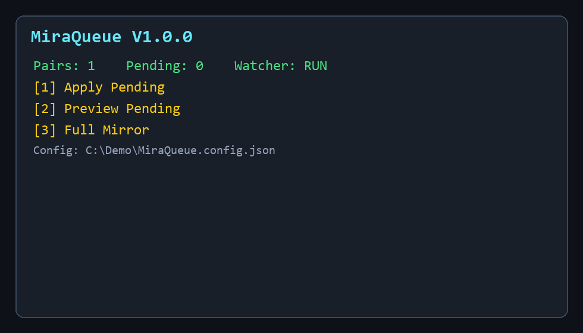
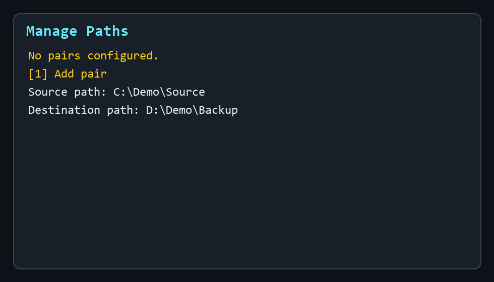
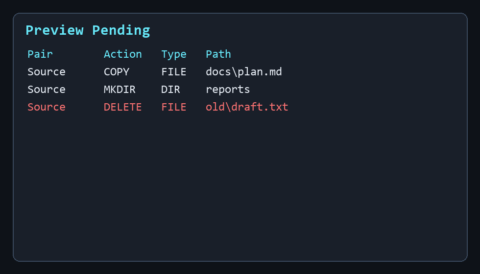
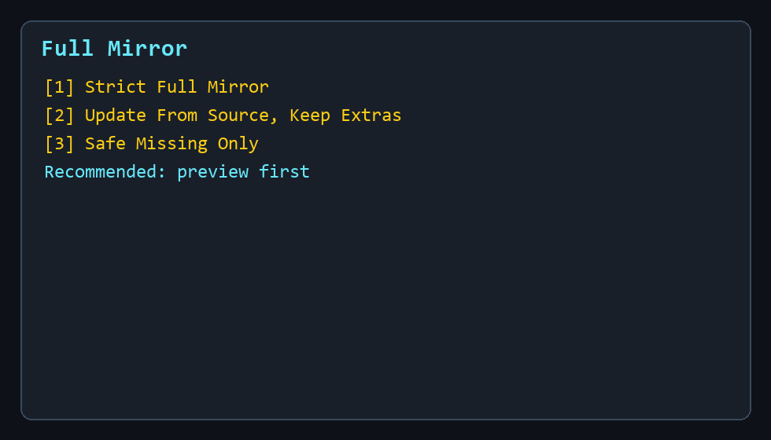

# MiraQueue 🪞

MiraQueue is a Windows PowerShell backup utility that watches source folders, stores changes in a pending queue, and lets you preview or apply mirror-style backup actions when you choose.

**Version:** V1.0.0  
**Platform:** Windows PowerShell with robocopy  
**License:** MIT



## Why MiraQueue

MiraQueue is built for controlled backups. Watch mode records filesystem events, Preview Pending shows effective work, Apply Pending performs queued changes, and Full Mirror compares whole folder pairs with a selected policy.

## Main Features

- Source-to-destination folder pairs managed from a console menu.
- Pending NDJSON queue for created, changed, deleted, and renamed items.
- Preview-first workflow before applying queued changes.
- Full Mirror modes for strict mirroring, update while keeping extras, and missing-only copy.
- Global and per-pair exclusions for folders and files.
- Scheduled watcher task support for logon-based background monitoring.
- Status screen for config, data folder, queue, task state, watcher count, and pair health.
- Runtime logs, log rotation, temp-file cleanup, and safer temp-then-replace copying.

## Quick Start

```powershell
powershell.exe -NoProfile -ExecutionPolicy Bypass -File .\MiraQueue.ps1
```

You can also double-click `Start_MiraQueue.cmd`.

1. Open **Manage Paths** and add a pair.
2. Use **Preview Pending** before **Apply Pending**.
3. Use **Full Mirror** only after reading [Safety](docs/safety.md).

## Safety Note

Strict mirror behavior can delete destination-only files when applying a full mirror policy. Use preview mode first and confirm that the destination path is correct before applying destructive policies.

## Demo





## Documentation

- [Documentation Index](docs/index.md)
- [Quick Start](docs/quick-start.md)
- [Installation](docs/installation.md)
- [Configuration](docs/configuration.md)
- [Safety](docs/safety.md)
- [Troubleshooting](docs/troubleshooting.md)
- [Repository Map](docs/maps/repository-map.md)
- [Complete Function Reference](docs/explanation/15-function-reference.md)
