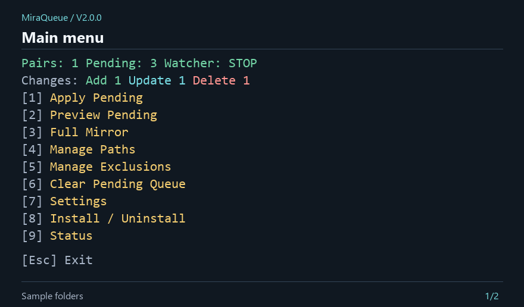
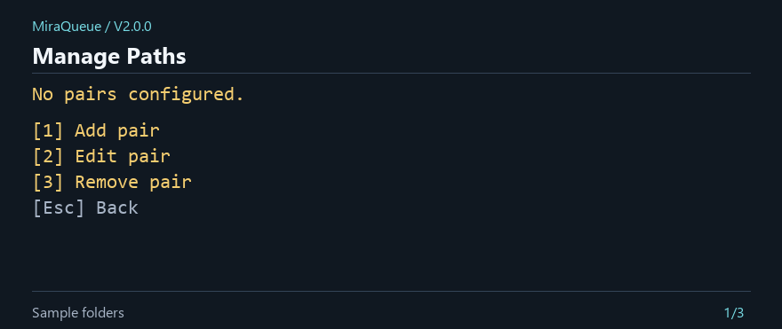
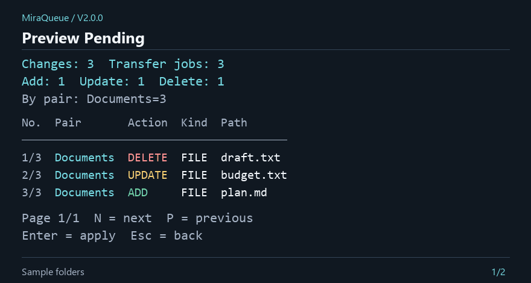
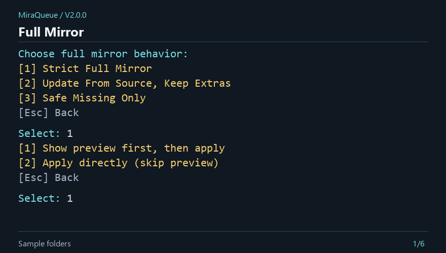

# MiraQueue 🪞

**V2.0.0 · Windows PowerShell 5.1 and PowerShell 7+ · MIT**

MiraQueue watches your source folders and records changes for you to review. You decide when to copy, update or delete destination content. It is a portable PowerShell script with a console menu, an optional logon watcher and no runtime package dependencies.

<p align="center">
  
</p>

<br>

## Why MiraQueue

Keep a removable backup disconnected until you need it. Watch mode collects changes without copying. **Preview Pending** shows the effective work; **Apply Pending** rechecks paths and applies it. **Full Mirror** compares complete folder pairs when you need an initial backup or want to recover changes missed while the watcher was stopped.

MiraQueue is a mirror utility, not a versioned archive. Updated files replace older destination content, and explicitly applied deletes are permanent.

## What's new in V2

- Queue schema 2: stable event IDs, destination baselines, operation labels and rebuildable metadata.
- Queue mutex shared by processes using the same queue; atomic replacements and fail-closed handling of malformed records.
- Read-only pending preview with Add / Update / Delete counts, grouped directory jobs and in-session destination observations.
- Restored-file and restored-directory reconciliation; newer events survive apply acknowledgment.
- Staged directory publication and safe merge when a destination directory already exists.
- Configurable **ParallelFileTransfers** (default 4, range 1–32), with conflicting destinations serialized.
- Full Mirror scans independent of robocopy's display language, with bounded parallel pair scans.
- Current-source checks before deletion, root containment checks, junction rejection and conservative uninstall.
- V1 configuration and NDJSON migration without resetting pairs, exclusions or user preferences.

## Quick start

1. Extract the project to a writable folder and open `Start_MiraQueue.cmd`, or run:

   ```powershell
   powershell.exe -NoProfile -ExecutionPolicy Bypass -File .\MiraQueue.ps1
   # PowerShell 7 is also supported:
   pwsh.exe -NoProfile -File .\MiraQueue.ps1
   ```

2. Choose **[4] Manage Paths**, then **Add pair**. Use separate source and destination trees.
3. Configure exclusions before copying. Run **[3] Full Mirror → Safe Missing Only → Show preview first** for an initial backup.
4. Start the watcher with `-Mode Watch`, or install it through **[8] Install / Uninstall**. The watcher queues changes only.
5. Review **[2] Preview Pending**, then explicitly apply from that screen or **[1] Apply Pending**.

### Add a folder pair

<p align="center">
  
</p>

<br>

## Choose the workflow

| Workflow | Copies or updates | Deletes | Pending queue |
| --- | --- | --- | --- |
| Watch | No | No | Records source events |
| Preview Pending | No | No | Reads without rewriting |
| Apply Pending | Recorded effective changes | Verified source deletions, if enabled | Acknowledges successful matching IDs |
| Full Mirror: `STRICT` | New and changed source items | Verified destination extras | Preserved |
| Full Mirror: `UPDATE_KEEP_EXTRAS` | New and changed source items | No | Preserved |
| Full Mirror: `MISSING_ONLY` | Missing items only | No | Preserved |

### Preview and apply pending changes

Review the queued additions, updates and deletions before applying them.

<p align="center">
  
</p>

<br>

### Compare Full Mirror policies

Choose whether to delete extras, keep extras or copy missing files only.

<p align="center">
  
</p>

<br>

The demos use sample folders and selected V2 console output.

## Safety and upgrades

Preview before applying. Keep an independent backup of irreplaceable files. Access errors and unavailable roots do not authorize deletion. Source/destination overlap, unsafe relative paths and reparse points are rejected. A cached preview is never final permission to delete. There is no filesystem-wide transaction against other programs modifying folders concurrently.

**Upgrading from V1:** stop the old watcher and close V1, preserve your config and runtime data, then replace the application files. V2 reads your existing config and adds missing defaults in memory. Queue normalization occurs under its mutex; malformed or unsupported records stop processing with the original queue preserved. Reinstall/restart the watcher through V2 after reviewing the upgrade. Do not run V1 and V2 against the same queue. [Upgrade details](docs/installation.md).

## Documentation

- [Documentation index](docs/index.md) · [Quick start](docs/quick-start.md) · [Installation / V1 upgrade](docs/installation.md)
- [Configuration](docs/configuration.md) · [Safety](docs/safety.md) · [Troubleshooting](docs/troubleshooting.md)
- [V2 release notes](docs/release-v2.0.0.md) · [Changelog](CHANGELOG.md)
- [Repository map](docs/maps/repository-map.md) · [Function reference](docs/explanation/15-function-reference.md)

Application runtime: Windows, PowerShell 5.1 or 7+, and Windows' built-in `robocopy.exe` for directory staging. No installer, service, Python runtime or package manager is required to use MiraQueue.
