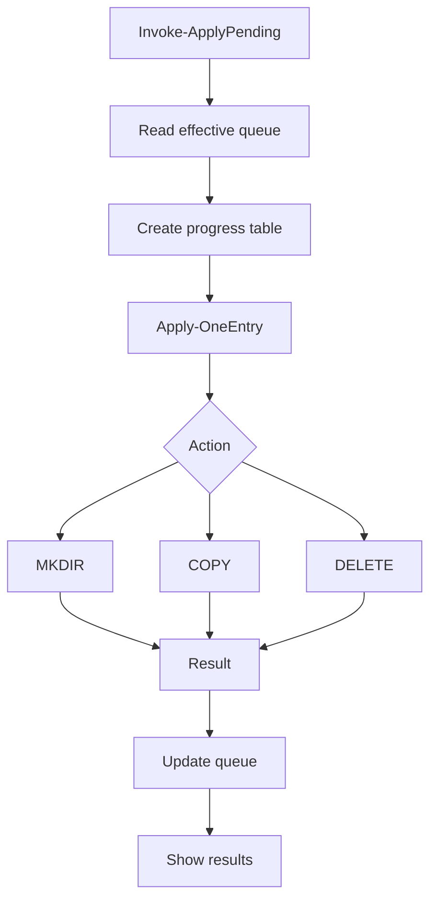

# Apply Pending Map

```mermaid
graph TD
  A[Invoke-ApplyPending] --> B[Read effective queue]
  B --> C[Create progress table]
  C --> D[Apply-OneEntry]
  D --> E{Action}
  E --> F[MKDIR]
  E --> G[COPY]
  E --> H[DELETE]
  F --> I[Result]
  G --> I
  H --> I
  I --> J[Update queue]
  J --> K[Show results]
```

Successful entries are removed from the queue; unresolved entries remain visible.
