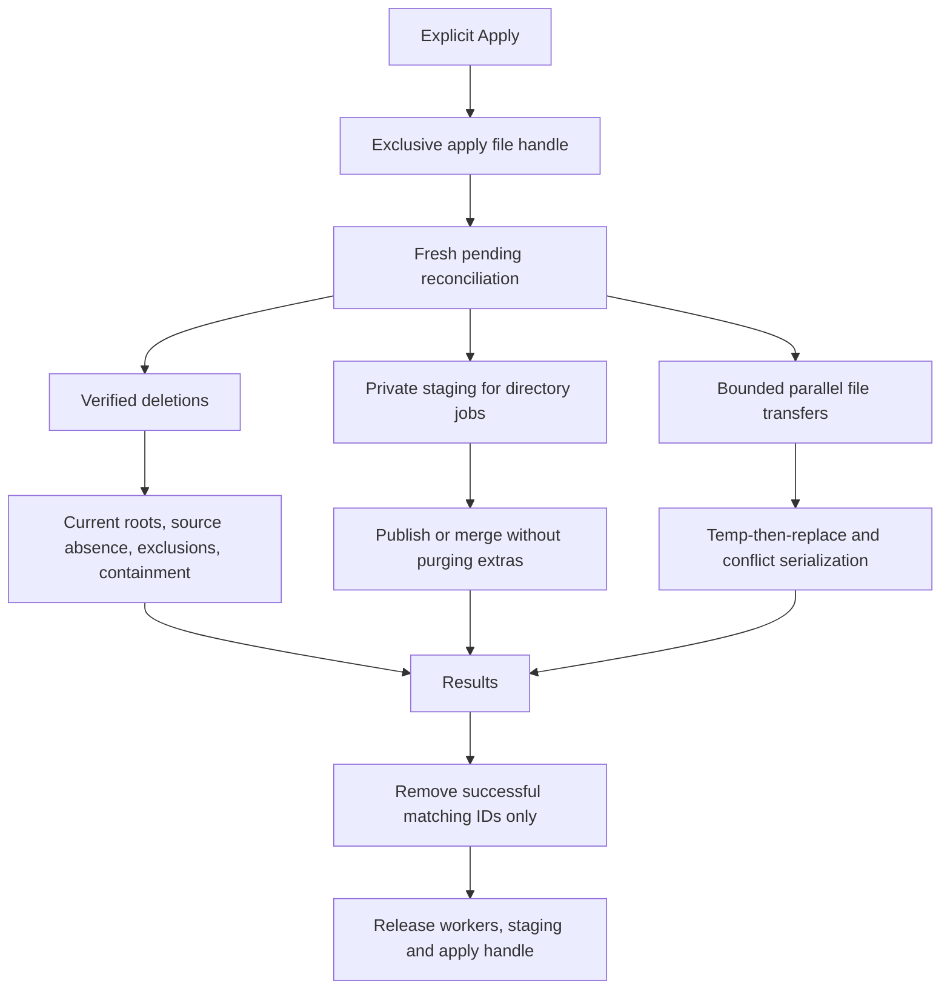

# Apply Pending map

```mermaid
flowchart TD
  A[Explicit Apply] --> B[Exclusive apply file handle]
  B --> C[Fresh pending reconciliation]
  C --> D[Verified deletions]
  C --> E[Private staging for directory jobs]
  C --> F[Bounded parallel file transfers]
  D --> G[Current roots, source absence, exclusions, containment]
  E --> H[Publish or merge without purging extras]
  F --> I[Temp-then-replace and conflict serialization]
  G --> J[Results]
  H --> J
  I --> J
  J --> K[Remove successful matching IDs only]
  K --> L[Release workers, staging and apply handle]
```

Failures, disabled deletes, unavailable roots and excluded pending entries remain queued. The snapshot is a display aid, not deletion authorization.
