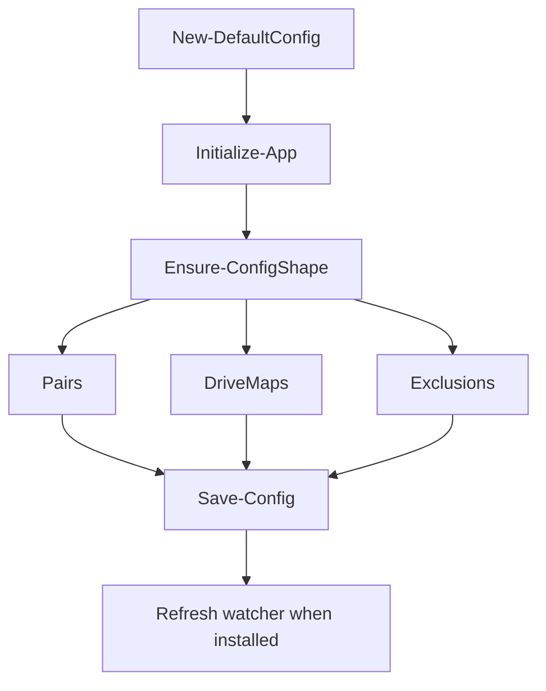

# Configuration Map

```mermaid
graph TD
  A[New-DefaultConfig] --> B[Initialize-App]
  B --> C[Ensure-ConfigShape]
  C --> D[Pairs]
  C --> E[DriveMaps]
  C --> F[Exclusions]
  D --> G[Save-Config]
  E --> G
  F --> G
  G --> H[Refresh watcher when installed]
```

Configuration repair keeps old or partial config files usable within V1.0.0 shape.
