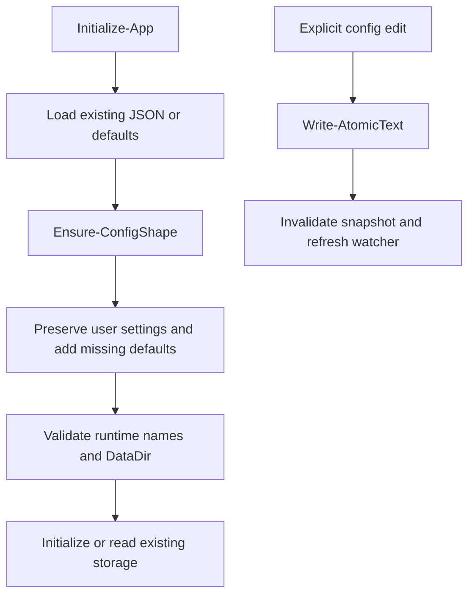

# Configuration map

Loading a V1 config does not rewrite it. Explicit saves persist V2 defaults/version while retaining unknown user fields. PreviewPending/Status use read-only initialization. See [configuration](../configuration.md).
