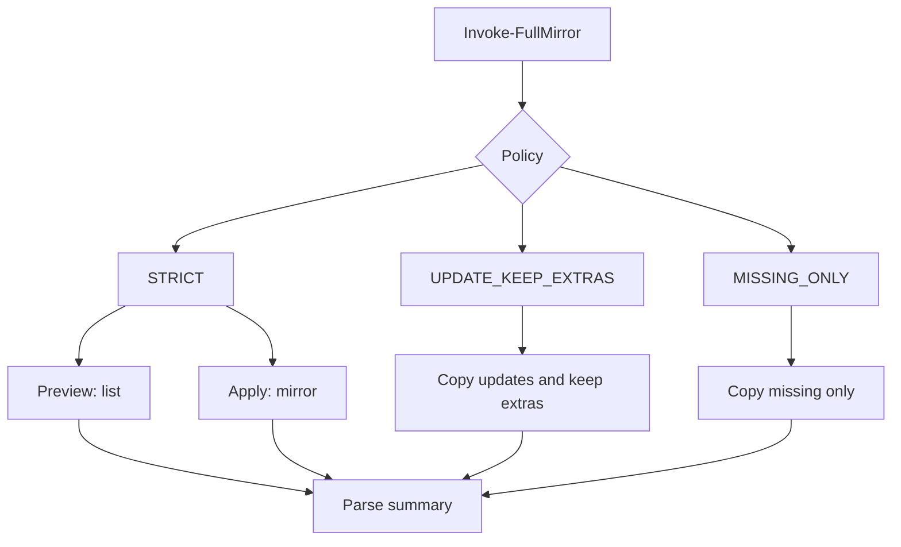

# Full Mirror Policy Map

```mermaid
graph TD
  A[Invoke-FullMirror] --> B{Policy}
  B --> C[STRICT]
  B --> D[UPDATE_KEEP_EXTRAS]
  B --> E[MISSING_ONLY]
  C --> F[Preview: list]
  C --> G[Apply: mirror]
  D --> H[Copy updates and keep extras]
  E --> I[Copy missing only]
  F --> J[Parse summary]
  G --> J
  H --> J
  I --> J
```

Full Mirror makes policy choice explicit before preview or apply.
