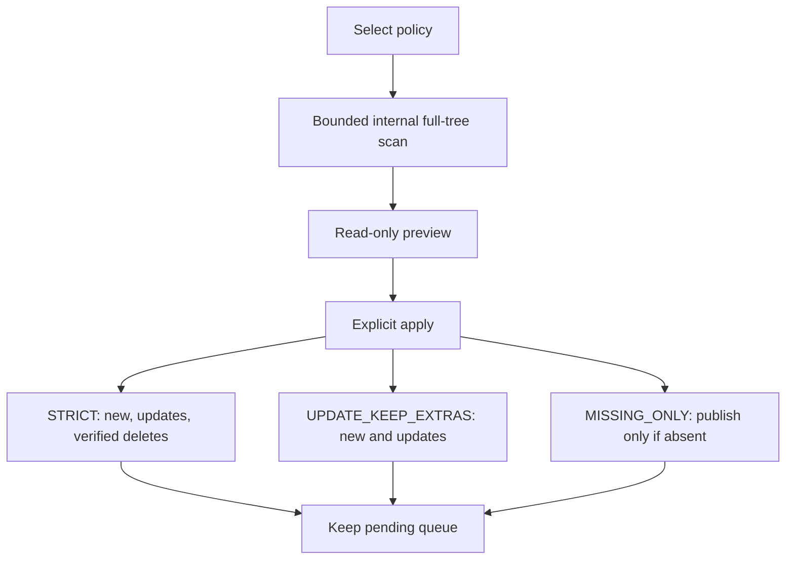

# Full Mirror policy map

Scans use terminating errors and reject reparse points/type conflicts. They are independent of robocopy output language. Apply creates only planned directories/files; it does not turn a mkdir into an unpreviewed subtree copy. Strict revalidates source absence; missing-only preserves a target created after preview.
