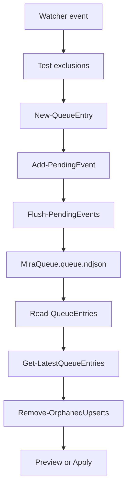

# Queue Lifecycle Map

```mermaid
graph TD
  A[Watcher event] --> B[Test exclusions]
  B --> C[New-QueueEntry]
  C --> D[Add-PendingEvent]
  D --> E[Flush-PendingEvents]
  E --> F[MiraQueue.queue.ndjson]
  F --> G[Read-QueueEntries]
  G --> H[Get-LatestQueueEntries]
  H --> I[Remove-OrphanedUpserts]
  I --> J[Preview or Apply]
```

The queue keeps watch detection separate from file changes.
