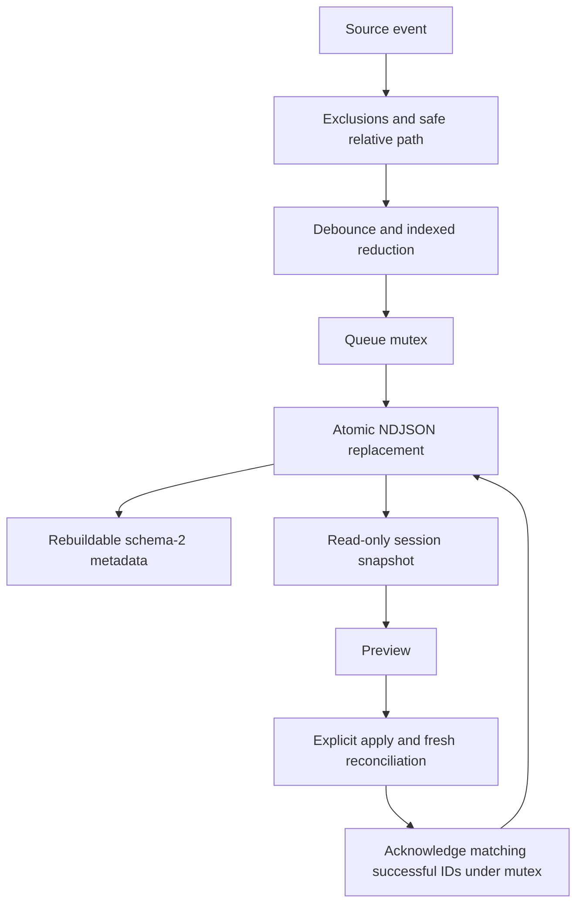

# Queue lifecycle map

V1 entries normalize under lock, preserving IDs and effective work. Unknown/malformed records stop the entire read. Destination observations remain in process memory. Newer events survive classification and acknowledgment. Full Mirror never empties this queue.
