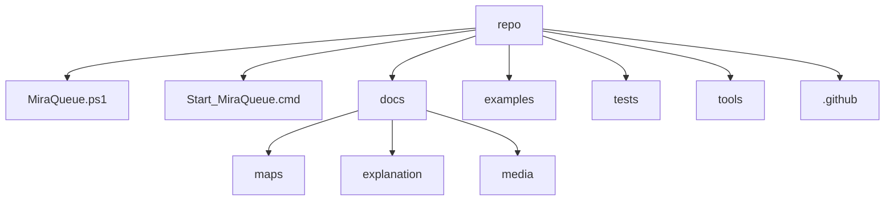

# Repository Map

```mermaid
graph TD
  A[repo] --> B[MiraQueue.ps1]
  A --> C[Start_MiraQueue.cmd]
  A --> D[docs]
  A --> E[examples]
  A --> F[tests]
  A --> G[tools]
  A --> H[.github]
  D --> I[maps]
  D --> J[explanation]
  D --> K[media]
```

The public repo contains the script, launcher, docs, examples, tests, tools, and CI.
