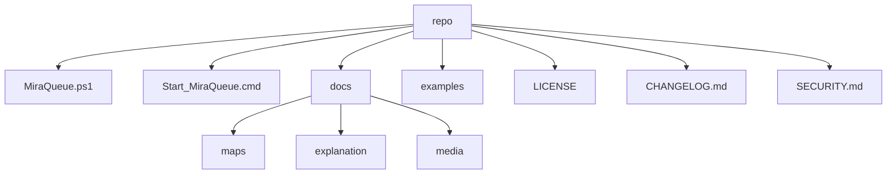

# Repository Map

```mermaid
graph TD
  A[repo] --> B[MiraQueue.ps1]
  A --> C[Start_MiraQueue.cmd]
  A --> D[docs]
  A --> E[examples]
  A --> F[LICENSE]
  A --> G[CHANGELOG.md]
  A --> H[SECURITY.md]
  D --> I[maps]
  D --> J[explanation]
  D --> K[media]
```

The public repo contains the end-user script, launcher, documentation, example configuration, license, release history, and security guidance.
