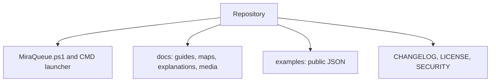

# Repository map

```mermaid
flowchart TD
  R[Repository] --> A[MiraQueue.ps1 and CMD launcher]
  R --> D[docs: guides, maps, explanations, media]
  R --> E[examples: public JSON]
  R --> H[CHANGELOG, LICENSE, SECURITY]
```

Only application files and Windows built-ins are runtime dependencies. Config, queue and logs are generated locally and ignored by Git.
