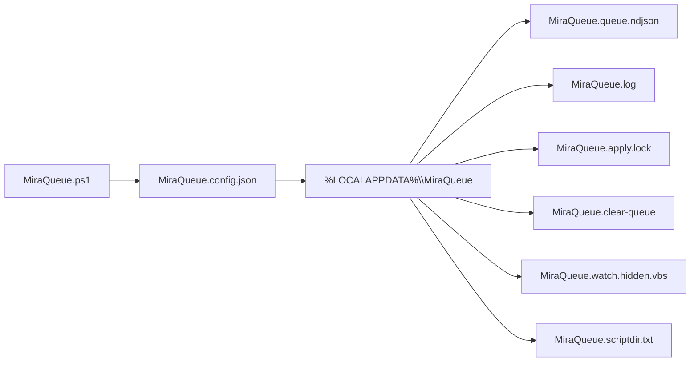

# Runtime Files Map

```mermaid
graph LR
  S[MiraQueue.ps1] --> C[MiraQueue.config.json]
  C --> D[%LOCALAPPDATA%\\MiraQueue]
  D --> Q[MiraQueue.queue.ndjson]
  D --> L[MiraQueue.log]
  D --> K[MiraQueue.apply.lock]
  D --> R[MiraQueue.clear-queue]
  D --> V[MiraQueue.watch.hidden.vbs]
  D --> P[MiraQueue.scriptdir.txt]
```

Config is stored beside the script. Runtime queue, logs, locks, and helper files live in the data folder.
