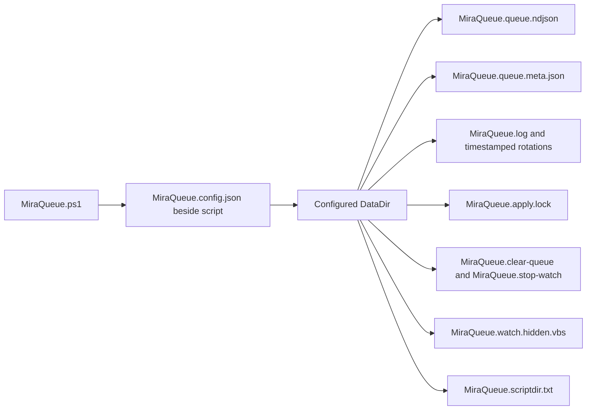

# Runtime files map

Default DataDir is `%LOCALAPPDATA%\MiraQueue`. Queue/log names are configurable simple filenames; other runtime names are fixed. Metadata is rebuildable. The apply lock file is reusable; ownership comes from its exclusive handle. Pointer/launcher files are UTF-16. Queue/config replacements create same-directory temporary files and clean them on handled completion. Destination copies/stages use `.mqtmp-`, `.mqbackup-`, `.mqdirtemp-` plus a random ID. Queue and watcher mutex names derive from queue-path identity; no external mutex files are created.
