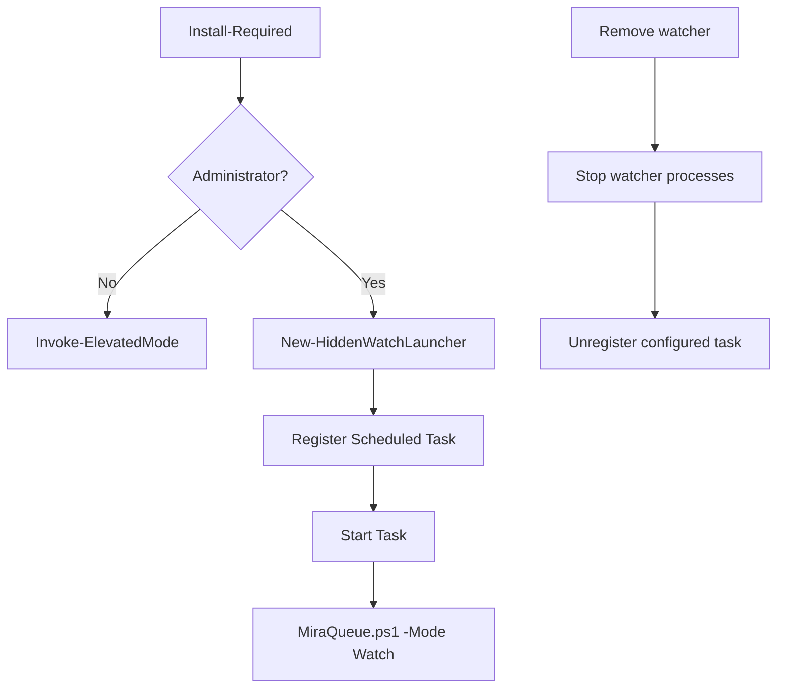

# Scheduled Task Map

```mermaid
graph TD
  A[Install-Required] --> B{Administrator?}
  B -->|No| C[Invoke-ElevatedMode]
  B -->|Yes| D[New-HiddenWatchLauncher]
  D --> E[Register Scheduled Task]
  E --> F[Start Task]
  F --> G[MiraQueue.ps1 -Mode Watch]
  H[Remove watcher] --> I[Stop watcher processes]
  I --> J[Unregister configured task]
```

Task Scheduler gives logon startup without installing a service.
