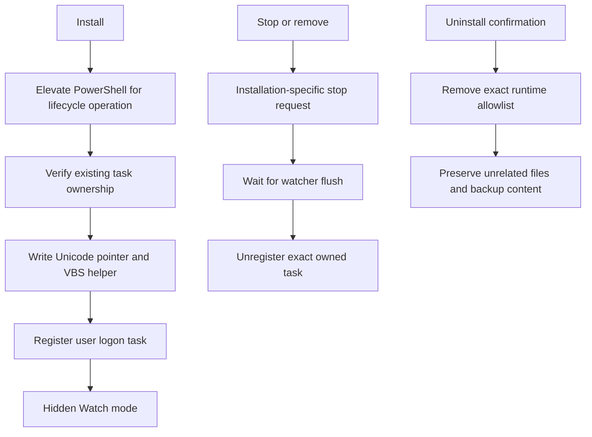

# Scheduled task map

```mermaid
flowchart TD
  A[Install] --> B[Elevate PowerShell for lifecycle operation]
  B --> C[Verify existing task ownership]
  C --> D[Write Unicode pointer and VBS helper]
  D --> E[Register user logon task]
  E --> F[Hidden Watch mode]
  G[Stop or remove] --> H[Installation-specific stop request]
  H --> I[Wait for watcher flush]
  I --> J[Unregister exact owned task]
  K[Uninstall confirmation] --> L[Remove exact runtime allowlist]
  L --> M[Preserve unrelated files and backup content]
```

Process matching includes the exact script path. Task matching includes the exact generated launcher action. V2 creates no shortcuts and preserves user-created ones.
