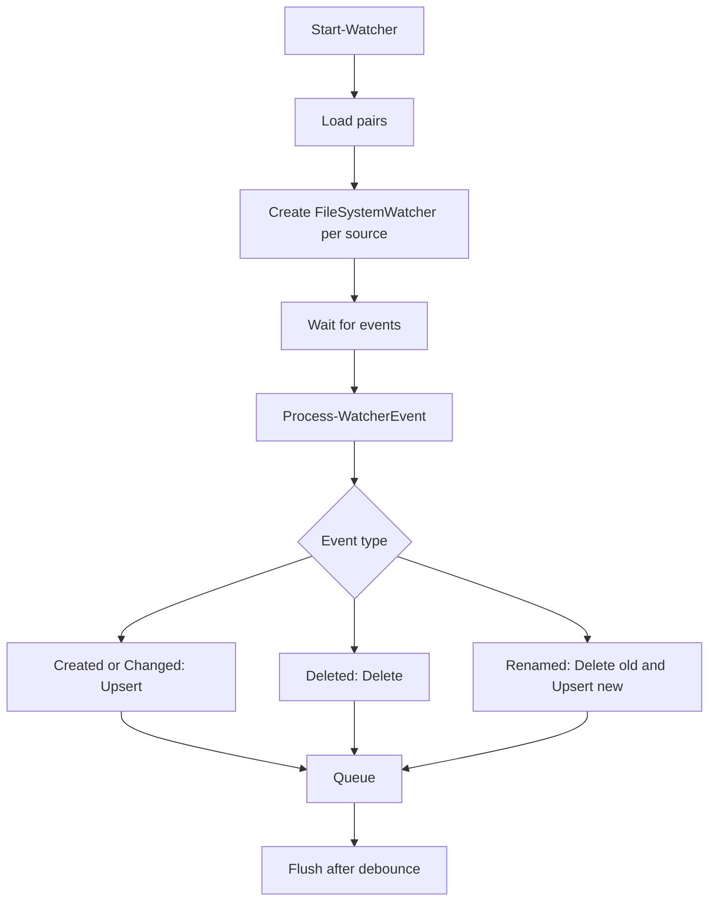

# Watcher Flow Map

```mermaid
graph TD
  A[Start-Watcher] --> B[Load pairs]
  B --> C[Create FileSystemWatcher per source]
  C --> D[Wait for events]
  D --> E[Process-WatcherEvent]
  E --> F{Event type}
  F --> G[Created or Changed: Upsert]
  F --> H[Deleted: Delete]
  F --> I[Renamed: Delete old and Upsert new]
  G --> J[Queue]
  H --> J
  I --> J
  J --> K[Flush after debounce]
```

Watch mode queues only and never copies files automatically.
