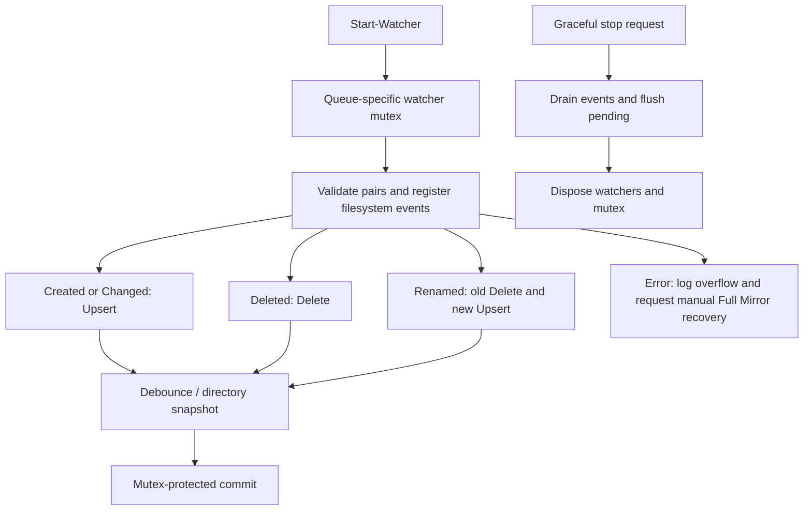

# Watcher flow map

The watcher never applies destination changes. Reconciled directory batches compare parent IDs. A forced crash can lose debounced memory; Full Mirror preview is the recovery workflow.
